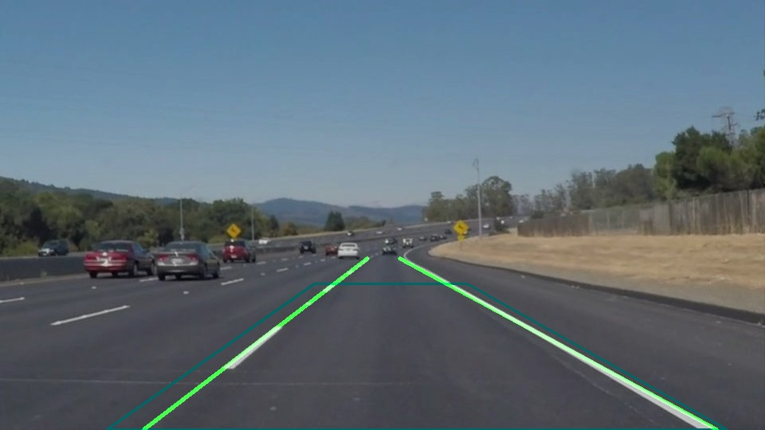

# Autonomous-Driving_Laneline_Detection_LixingZhang
### A laneline detector using canny edge detection and Hough Transformation
##Overview
This project is based on the Udacity nanodegree program "Self-driving Car Engineer".
Besides the P1.ipynb jupyter notebook file which is required in the course project,
I also created my own module of edge detection.

This project aims in detecting the simplest case of lanemark detection - finding well-painted straight lanelines on both sides of the ego-vehicle.

The basic detecting scheme works in such a pipeline: 

1.Extract geometrically the region of interest, in which both lane-lines appear.  
2.Use a **Canny lane detector** to detect all edges in the extracted region.  
3.Use a **Hough transmitter** to transmitt all edges into single, long straight lines.  
4.Group all lines into 2 groups, representing 2 lanes on both sides.

A sample output is shown as below:

##Structure
**The *Udacity_P1.ipynb* and *write_up.md* files are course requirements for project 1 of the Udacity Course.
  